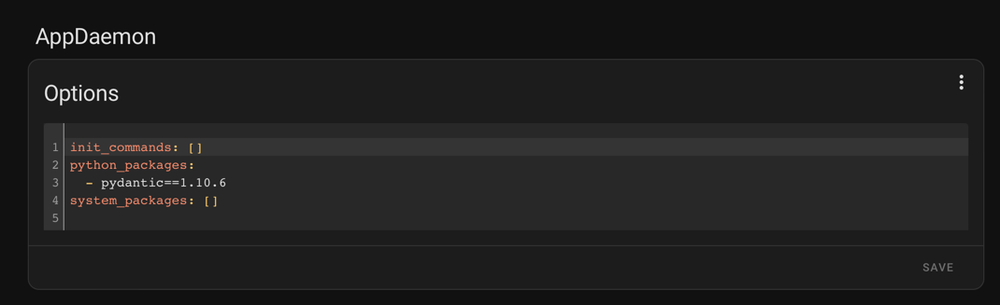
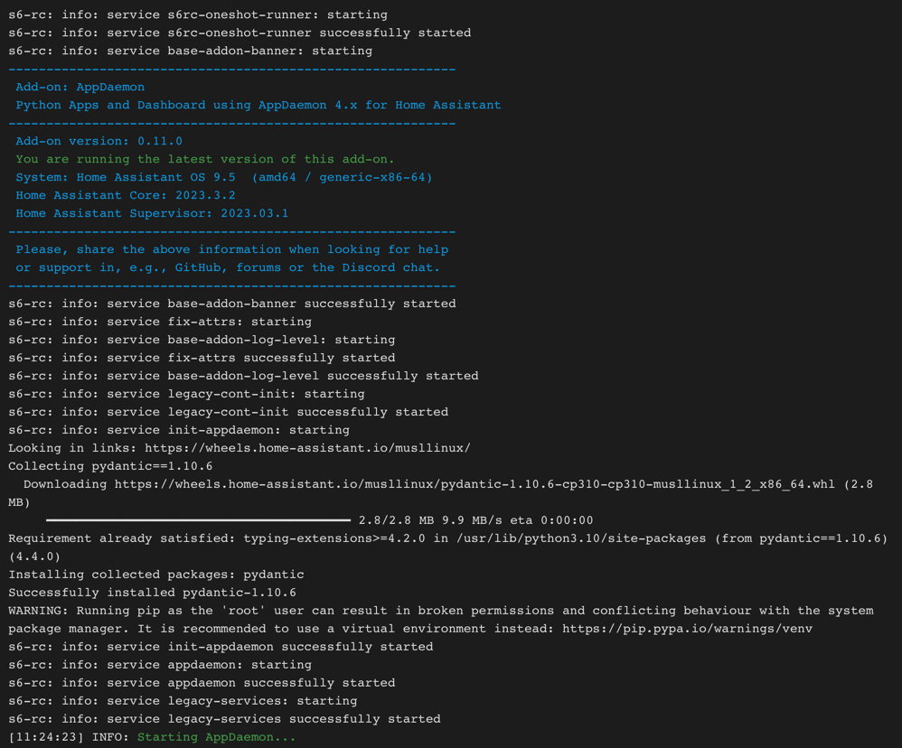
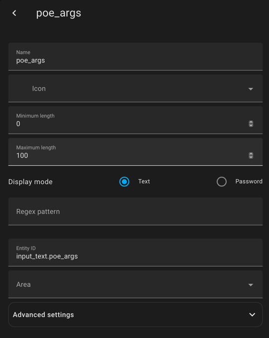
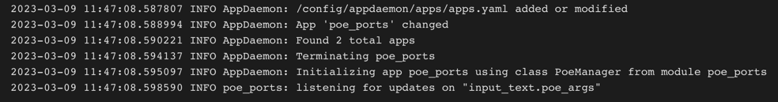
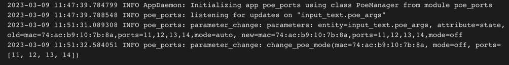

# Simple API to control Ubiquity switches integrated into Home Assistant

Main goal is to control the PoE state of some switch ports from Homeassistant using the [AppDeamon AddOn](https://appdaemon.readthedocs.io/en/latest/) for 
[Home Assistant](https://www.home-assistant.io/).

## AppDaemon setup

1) Install AppDaemon AddOn based on [documentation](https://appdaemon.readthedocs.io/en/latest/index.html)
2) Define requirements
   * Export requirements 
            
         % pipenv requirements --exclude-markers
         Loading .env environment variables...
         -i https://pypi.org/simple
         certifi==2022.12.7
         charset-normalizer==3.1.0
         idna==3.4
         pydantic==1.10.6
         python-dotenv==1.0.0
         requests==2.28.2
         typing-extensions==4.5.0
         urllib3==1.26.14
   * add requirements to the AppDaemon configuration
      
     don't add dependencies as this can cause version conflicts during AppDaemon startup 
     
   * restart AppDaemon and check that packages get installed, also check for errors
     

## Install app

Create a directory for the app in the appdeamon/apps directory and copy Python files.

    appdaemon
    ├── appdaemon.yaml
    ├── apps
    │   ├── apps.yaml
    │   ├── hello.py
    │   └── poe_ports
    │       ├── poe_ports.py
    │       └── simple_unifi
    │           └── __init__.py
    ├── compiled
    │   ├── css
    │   │   └── default
    │   │       └── hello_application.css
    │   ├── html
    │   │   └── default
    │   │       ├── hello_body.html
    │   │       └── hello_head.html
    │   └── javascript
    │       ├── application.js
    │       └── default
    │           └── hello_init.js
    ├── dashboards
    │   └── Hello.dash
    ├── namespaces
    └── www

## create the input helper to be used to trigger the Python script

The script monitors a text input helper for changes and on change takes the current state as parameters for script 
execution. This helper need to be created and then the entity id used in the script configuration.



## Configure `apps.yaml`

In `apps.yaml` we need to define the new app and some parameters:
* arg_helper: the entity of the text input helper used to communicate with tha app
* unifi_host: API host
* unifi_user: user to authenticate API calls
* unifi_pass: password to authenticate API calls

```
---
hello_world:
  module: hello
  class: HelloWorld

poe_ports:
  module: poe_ports
  class: PoeManager
  args_helper: input_text.poe_args
  unifi_host: 192.168.177.1
  unifi_user: jkrohn
  unifi_pass: <password>
```

After updating `apps.yaml` verify startup and app initialization in the AppDaemon log:


## Verify operation

To verify operation now the helper can be set to meaningful parameters like: 
    
    mac=74:ac:b9:10:7b:8a,ports=11,12,13,14,mode=off


.. and that should trigger execution of the app which can be monitored in the AppDaemon log again


## Automations

Finally, automations can be built that set the helper to trigger app execution. Here's an example of an automation that 
controls PoE state of some ports depending on the state of a switch:

```yaml
alias: mpp poe state
description: Change MPP PoE state depending on state of desktop plug
trigger:
  - platform: state
    entity_id:
      - switch.plugdesktop
condition: []
action:
  - choose:
      - conditions:
          - condition: template
            value_template: "{{trigger.to_state.state=='on'}}"
        sequence:
          - service: input_text.set_value
            data:
              value: mac=74:ac:b9:10:7b:8a,ports=11,12,13,14,mode=auto
            target:
              entity_id: input_text.poe_args
      - conditions:
          - condition: template
            value_template: "{{trigger.to_state.state=='off'}}"
        sequence:
          - service: input_text.set_value
            data:
              value: mac=74:ac:b9:10:7b:8a,ports=11,12,13,14,mode=off
            target:
              entity_id: input_text.poe_args
mode: single
```
